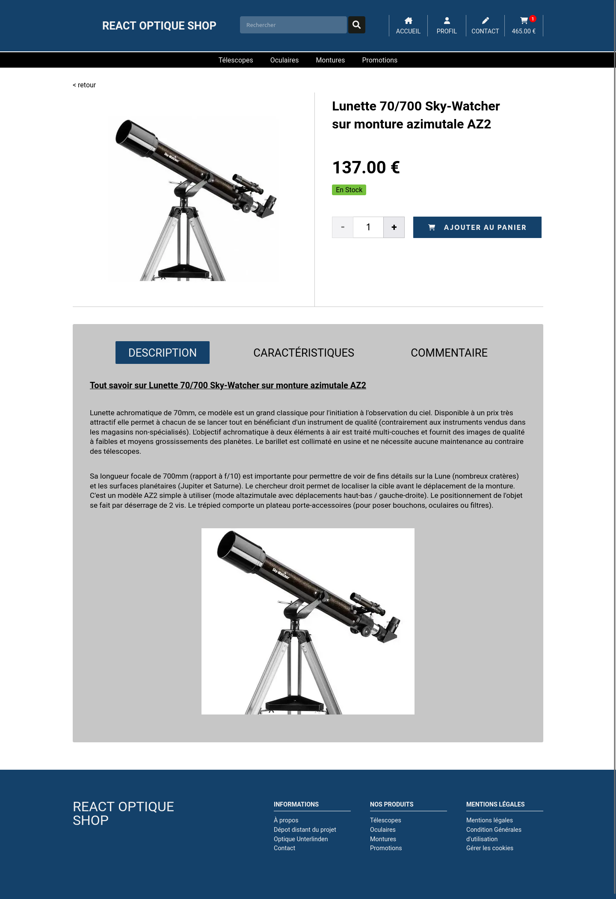
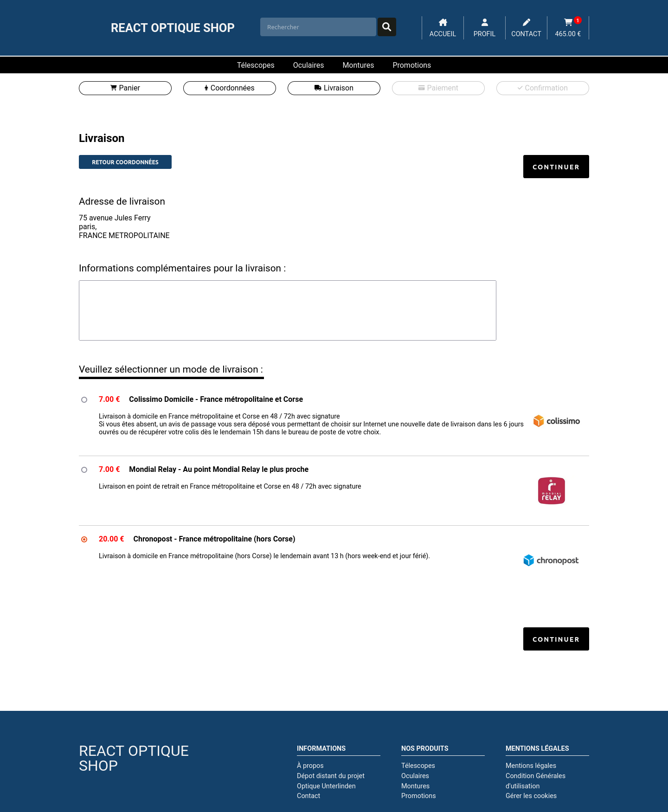

# REACT OPTIQUE SHOP

React optique shop est un site d'e-commerce fictif, réalisé avec React et redux pour la partie front-end, sass pour le css, Node JS et son framework express pour la partie back-end et MariaDB comme base de données, le tout hébergés sur un server ubuntu via Nginx.

Le site fonctionne comme une boutique en ligne classique hormis la phase de paiement, qui est juste simulée.

Le design du site est largement inspiré d'[Optique Unterlinden](https://www.telescopes-et-accessoires.fr/).

## Quelques screenshot

### Page d'accueil

### Liste des produits, ici la catégorie Oculaires

### Une page produit

### La page Livraison du panier

## Live site

Vous pouvez visiter et tester le site via ce lien: [React optique shop](https://www.e-commerce.julienlenfume.com/).